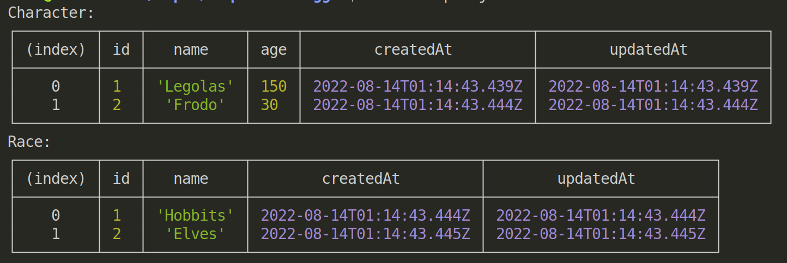

# Sequelize Logger

A very basic utility for logging Sequelize data. This package can log multiple tables, the entire database (including junction tables), and individual queries. It saves a few lines of code.



## Running the example

If you wish to run `example.js`, you need to run
```bash
npm install sqlite3 sequelize
```

## Functions

Suppose we have the following schema:

```js
// initialise the database
const db = new Sequelize({
  storage: ':memory:',
  dialect: 'sqlite',
  logging: false
})

// create some models
const Character = db.define('Character', {
  name: { type: DataTypes.STRING },
  age: { type: DataTypes.INTEGER }
})

const Race = db.define('Race', {
  name: { type: DataTypes.STRING }
})

// define some associations
Race.belongsToMany(Character, { through: 'Character_Race' })
Character.belongsToMany(Race, { through: 'Character_Race' })
```

### Log a table

```js
// Pass in a model and its table will be logged
await logTable(Character)
// If model name is used, sequelize instance must be passed
// If this is omitted, a warning will be logged
await logTable('Race', db)
// You generally don't have the junction table model at hand, but it can be
// logged like so:
await logTable(db.models.Character_Race)
```

### Log multiple tables

```js
// Can log the tables for multiple models
await logTables(Character, Race)
// If any model is given by its name, sequelize instance must be passed
await logTables('Character', Race, db)
```
### Log all tables

```js
// All tables associated with the instance are logged
// This includes junction tables
await logAllTables(db)
```

### Log query

```js
// Can handle single entry returns as well as arrays
await logQuery(Character.findOne())
// Optional text appears above log
await logQuery(Character.findAll(), { text: 'All characters' })
// Table can't deal with nested objects so it can be turned off
await logQuery(Race.findOne({ include: Character }))
```
